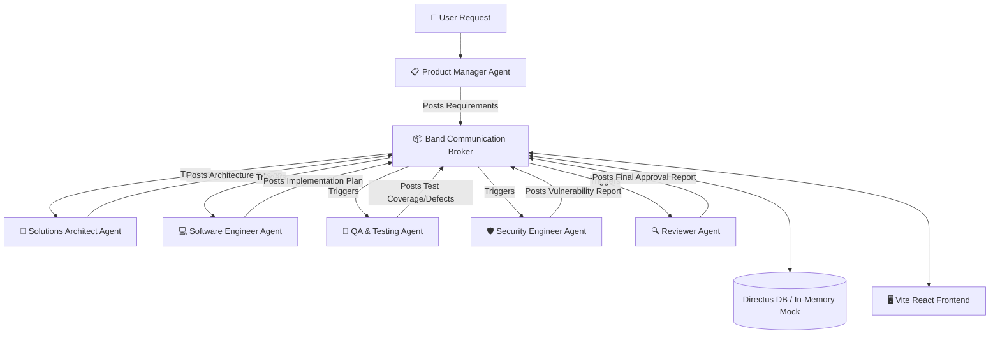

# CodeBand AI 🚀
### A Virtual Multi-Agent Software Development Team Orchestrated via Band

[](https://opensource.org/licenses/ISC)
[]()
[]()
[]()

**CodeBand AI** is a proof-of-concept multi-agent software development platform built for the **Band of Agents Hackathon**. It demonstrates a virtual software engineering organization where specialized, autonomous agents (Product Manager, Solutions Architect, Software Engineer, QA, Security, and Reviewer) collaborate through **Band** as their communication, context-sharing, and coordination layer.

---

## 🏗️ Architecture Overview

Rather than running as a single monolithic agent, CodeBand AI mirrors a real software engineering department. Every agent owns a specific domain and publishes messages or deliverables to a shared Band message broker.



---

## 📋 Ubuntu/Linux System Prerequisites

To run this platform on Ubuntu, ensure you have the following installed:

1. **Python 3.10 or higher** (with virtual environment support):
   ```bash
   sudo apt update
   sudo apt install python3 python3-pip python3-venv lsof curl -y
   ```
2. **Node.js (v18+) and npm**:
   ```bash
   # Install using NodeSource repository
   curl -fsSL https://deb.nodesource.com/setup_18.x | sudo -E bash -
   sudo apt-get install -y nodejs
   ```
3. **Ollama** (for local LLM execution):
   ```bash
   curl -fsSL https://ollama.com/install.sh | sh
   ```
   After installation, pull the default model used by the platform:
   ```bash
   ollama pull qwen3:8b
   ```
4. **PostgreSQL** (Optional; only required if running in database-connected mode rather than Mock Mode):
   ```bash
   sudo apt install postgresql postgresql-contrib -y
   ```

---

## ⚡ Quick Start on Ubuntu (Automated)

We have provided a unified bash startup script **`start-all.sh`** that automates the setup, config checks, dependency installations, and concurrent execution of all services.

### 1. Make the Script Executable
```bash
chmod +x start-all.sh
```

### 2. Run the Startup Script
By default, the script boots the platform in **Offline Mock Mode** (`DIRECTUS_MOCK_MODE=true`). This runs the platform locally using in-memory structures, meaning you don't need to configure a local PostgreSQL or Directus database.
```bash
./start-all.sh
```

To run with **full Directus & database integration**, simply set `DIRECTUS_MOCK_MODE=false` before executing:
```bash
export DIRECTUS_MOCK_MODE="false"
./start-all.sh
```

### What `start-all.sh` Does:
* Verifies system dependencies (`python3`, `node`, `npm`, `ollama`).
* Initializes the python virtual environment (`.venv`) and installs `requirements.txt`.
* Generates a default `.env` configuration file if one is missing.
* Checks for local port conflicts (ports `8000`, `4200`, `5173`, and optionally `8055`).
* Starts the **Prefect Server** (with `sqlite+aiosqlite:///:memory:` to avoid SQLite concurrency write locks).
* (Optionally) Installs and runs the **Directus** daemon.
* Runs the platform bootstrapper to seed database collections and load agent registries.
* Launches the **FastAPI REST API Backend** (`uvicorn`).
* Installs dependencies and launches the **Vite React Frontend**.
* Cleanly intercepts termination interrupts (`Ctrl+C`) and stops all running background services.

---

## 🛠️ Manual Execution on Ubuntu

If you prefer to start each service individually in separate terminals, follow these steps:

### 1. Virtual Environment & Requirements
```bash
python3 -m venv .venv
source .venv/bin/activate
pip install -r requirements.txt
```

### 2. Configure Environment Variables
Create a `.env` file in the project root:
```env
# Directus Database Settings
NEXT_PUBLIC_DIRECTUS_URL=http://localhost:8055
DIRECTUS_API_TOKEN=your-directus-token-here

# Ollama / LLM Settings
LLM_BASE_URL=http://localhost:11434/v1
LLM_MODEL=qwen3:8b

# Prefect Server Settings
PREFECT_API_URL=http://127.0.0.1:4200/api
```

### 3. Start Prefect Server
Force Prefect to run with an in-memory SQLite database to prevent concurrent write locks:
```bash
source .venv/bin/activate
export PREFECT_API_DATABASE_CONNECTION_URL="sqlite+aiosqlite:///:memory:"
prefect server start
```

### 4. (Optional) Run Directus
If not using `DIRECTUS_MOCK_MODE="true"`, launch the Directus backend:
```bash
cd apps/directus
npm install
npm run start
```

### 5. Run Platform Bootstrapper
Seed the default agents and check external service connectivity:
```bash
source .venv/bin/activate
# Set DIRECTUS_MOCK_MODE=true if you aren't running local Directus
export DIRECTUS_MOCK_MODE="true" 
python apps/api/src/bootstrap/launcher.py
```

### 6. Start FastAPI Backend
```bash
source .venv/bin/activate
uvicorn apps.api.src.main:app --reload --port 8000
```

### 7. Start React Frontend
```bash
cd apps/web
npm install
npm run dev
```

---

## ⚙️ Configuration Reference

| Environment Variable | Description | Default / Example |
| :--- | :--- | :--- |
| `DIRECTUS_MOCK_MODE` | Skips connection checks and serves mock memory data | `true` (offline/mock) or `false` (DB-connected) |
| `NEXT_PUBLIC_DIRECTUS_URL` | Base URL of Directus service | `http://localhost:8055` |
| `DIRECTUS_API_TOKEN` | Auth token for read/write access to Directus | Static generated token |
| `LLM_BASE_URL` | OpenAI-compatible endpoint for Ollama or other LLMs | `http://localhost:11434/v1` |
| `LLM_MODEL` | LLM model identifier | `qwen3:8b` |
| `PREFECT_API_URL` | Local Prefect server REST API endpoint | `http://127.0.0.1:4200/api` |

---

## ❓ Troubleshooting on Ubuntu

For full solutions, consult the [Startup & Troubleshooting Guide](docs/startup_troubleshooting.md).

### 1. Prefect Router `AttributeError`
* **Symptom**: `AttributeError: 'PrefectRouter' object has no attribute 'routes'` on startup.
* **Resolution**: Downgrade FastAPI inside the virtual environment:
  ```bash
  pip install fastapi==0.111.0
  ```

### 2. SQLite Concurrency locks (`database is locked`)
* **Symptom**: Prefect or workflows hang or throw sqlite lock errors.
* **Resolution**: Ensure the env variable `PREFECT_API_DATABASE_CONNECTION_URL` is set to `"sqlite+aiosqlite:///:memory:"` prior to launching `prefect server start`.

### 3. Directus 401 Unauthorized Error
* **Symptom**: Model failures or seeder errors saying `401 Unauthorized`.
* **Resolution**: Ensure your `DIRECTUS_API_TOKEN` is correctly generated as a **Static Token** on your admin profile inside Directus, and that your role has adequate permissions (Admin role is recommended for local development).
