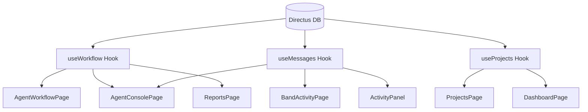

# TASK-003: Frontend Integration with Directus Backend

## Metadata

| Field        | Value                                          |
| ------------ | ---------------------------------------------- |
| Task ID      | TASK-003 |
| Owner        | Antigravity                                    |
| Team Member  | Prashant                                       |
| Date Started | 2026-06-17                                     |
| Last Updated | 2026-06-18 |
| Status       | Complete                                       |
| Priority     | High                                           |

---

# Problem Statement

The frontend UI dashboard, projects page, reports, activity logs, and console screens were built using static mock data arrays, making the application disconnected from the live Directus database backend.

---

# Objective

Fully integrate all frontend UI screens with the newly implemented Directus service layer, hooks, and client-side simulation engine, enabling real-time workspace updates and multi-agent workflow triggers.

---

# Context

This task completes the implementation phase outlined in `docs/requirements/ui_backend_integration.md`. It links the state management hooks to the UI pages so that project selection is propagated correctly and the user can experience the live agent workflow.

---

# AI Session Summary

## Tools Used

- Gemini
- Code Edit Tools

---

## Prompts Summary

- Dynamic routing & navigation binding
- Projects list retrieval and selection handler
- Mapping Directus runs to visual flow nodes
- Setting up the active workflow simulator trigger
- Sidebar live activity subscription

---

# Decisions Made

✓ Reused the visual design structure and styling of the mock pages while replacing the data sources with live React hooks.

✓ Introduced `lib/agent-mapper.ts` as a reusable data transformer to translate database run tables to the UI's specialized node statuses.

✓ Configured automatic polling to simulate real-time agent output updates on the dashboard, activity panel, and agent console.

---

# Technical Design

---

# Files Changed

<!-- FILES_CHANGED_START -->
- [apps/directus/datamodel/samples/002_stocker_import_collections.sql](../../apps/directus/datamodel/samples/002_stocker_import_collections.sql)
- [apps/web/package-lock.json](../../apps/web/package-lock.json)
- [apps/web/package.json](../../apps/web/package.json)
- [apps/web/src/app/App.tsx](../../apps/web/src/app/App.tsx)
- [apps/web/src/app/components/ActivityPanel.tsx](../../apps/web/src/app/components/ActivityPanel.tsx)
- [apps/web/src/app/components/Sidebar.tsx](../../apps/web/src/app/components/Sidebar.tsx)
- [apps/web/src/app/components/WorkflowDiagram.tsx](../../apps/web/src/app/components/WorkflowDiagram.tsx)
- [apps/web/src/app/components/pages/AgentConsolePage.tsx](../../apps/web/src/app/components/pages/AgentConsolePage.tsx)
- [apps/web/src/app/components/pages/AgentWorkflowPage.tsx](../../apps/web/src/app/components/pages/AgentWorkflowPage.tsx)
- [apps/web/src/app/components/pages/BandActivityPage.tsx](../../apps/web/src/app/components/pages/BandActivityPage.tsx)
- [apps/web/src/app/components/pages/DashboardPage.tsx](../../apps/web/src/app/components/pages/DashboardPage.tsx)
- [apps/web/src/app/components/pages/LoginPage.tsx](../../apps/web/src/app/components/pages/LoginPage.tsx)
- [apps/web/src/app/components/pages/NewProjectPage.tsx](../../apps/web/src/app/components/pages/NewProjectPage.tsx)
- [apps/web/src/app/components/pages/ProjectsPage.tsx](../../apps/web/src/app/components/pages/ProjectsPage.tsx)
- [apps/web/src/app/components/pages/ReportsPage.tsx](../../apps/web/src/app/components/pages/ReportsPage.tsx)
- [apps/web/src/context/DirectusAuthContext.tsx](../../apps/web/src/context/DirectusAuthContext.tsx)
- [apps/web/src/hooks/useDashboard.ts](../../apps/web/src/hooks/useDashboard.ts)
- [apps/web/src/hooks/useMessages.ts](../../apps/web/src/hooks/useMessages.ts)
- [apps/web/src/hooks/useProjects.ts](../../apps/web/src/hooks/useProjects.ts)
- [apps/web/src/hooks/useReport.ts](../../apps/web/src/hooks/useReport.ts)
- [apps/web/src/hooks/useWorkflow.ts](../../apps/web/src/hooks/useWorkflow.ts)
- [apps/web/src/lib/agent-mapper.test.ts](../../apps/web/src/lib/agent-mapper.test.ts)
- [apps/web/src/lib/agent-mapper.ts](../../apps/web/src/lib/agent-mapper.ts)
- [apps/web/src/lib/directus-schema.ts](../../apps/web/src/lib/directus-schema.ts)
- [apps/web/src/lib/directus.ts](../../apps/web/src/lib/directus.ts)
- [apps/web/src/main.tsx](../../apps/web/src/main.tsx)
- [apps/web/src/services/agent.service.ts](../../apps/web/src/services/agent.service.ts)
- [apps/web/src/services/auth.service.ts](../../apps/web/src/services/auth.service.ts)
- [apps/web/src/services/dashboard.service.ts](../../apps/web/src/services/dashboard.service.ts)
- [apps/web/src/services/message.service.ts](../../apps/web/src/services/message.service.ts)
- [apps/web/src/services/project.service.ts](../../apps/web/src/services/project.service.ts)
- [apps/web/src/services/report.service.ts](../../apps/web/src/services/report.service.ts)
- [apps/web/src/services/workflow.service.ts](../../apps/web/src/services/workflow.service.ts)
- [apps/web/src/types/index.ts](../../apps/web/src/types/index.ts)
- [apps/web/vite.config.ts](../../apps/web/vite.config.ts)
- [band-masd.code-workspace](../../band-masd.code-workspace)
- [docs/requirements/intelligence_implementation.md](../../docs/requirements/intelligence_implementation.md)
- [docs/requirements/intelligence_implementation_V2.md](../../docs/requirements/intelligence_implementation_V2.md)
- [docs/requirements/ui_backend_integration.md](../../docs/requirements/ui_backend_integration.md)
- [graphify-out/.graphify_labels.json](../../graphify-out/.graphify_labels.json)
- [graphify-out/GRAPH_REPORT.md](../../graphify-out/GRAPH_REPORT.md)
- [graphify-out/cache/ast/00883ca9cc90d453d265b7b324aa8874c6c031d48383b1b0cae19954b1c85feb.json](../../graphify-out/cache/ast/00883ca9cc90d453d265b7b324aa8874c6c031d48383b1b0cae19954b1c85feb.json)
- [graphify-out/cache/ast/050550df68644a8182a6832e1d6ee021f43c069c0bf785867a78c60cfa351fc7.json](../../graphify-out/cache/ast/050550df68644a8182a6832e1d6ee021f43c069c0bf785867a78c60cfa351fc7.json)
- [graphify-out/cache/ast/08127cdebf3f39418008dbf5678cd61c9a04c1a466b743ee6fcbfe0e077e95e5.json](../../graphify-out/cache/ast/08127cdebf3f39418008dbf5678cd61c9a04c1a466b743ee6fcbfe0e077e95e5.json)
- [graphify-out/cache/ast/0c0d75221e673fbb1b1cbdb24b3001cc313c0a2aa2c1d8ca7c364d61e8fcb329.json](../../graphify-out/cache/ast/0c0d75221e673fbb1b1cbdb24b3001cc313c0a2aa2c1d8ca7c364d61e8fcb329.json)
- [graphify-out/cache/ast/0f4af67e5b9055eb933e00a3bb6fffadeca982708bf96ab073ff024018d9df90.json](../../graphify-out/cache/ast/0f4af67e5b9055eb933e00a3bb6fffadeca982708bf96ab073ff024018d9df90.json)
- [graphify-out/cache/ast/0feec56fede8b483f6101e02842d244c9dd5e0dbc2e5f4427c4f0ca5d3c10aa2.json](../../graphify-out/cache/ast/0feec56fede8b483f6101e02842d244c9dd5e0dbc2e5f4427c4f0ca5d3c10aa2.json)
- [graphify-out/cache/ast/11525fddd125ea1d6d8a258c706272db4d6fa8a8eb201032150e4072e479afc1.json](../../graphify-out/cache/ast/11525fddd125ea1d6d8a258c706272db4d6fa8a8eb201032150e4072e479afc1.json)
- [graphify-out/cache/ast/137f9c79abe37dc5c97f627dd9d08251eee0e651da245e3432ed5f40ada0788a.json](../../graphify-out/cache/ast/137f9c79abe37dc5c97f627dd9d08251eee0e651da245e3432ed5f40ada0788a.json)
- [graphify-out/cache/ast/1867611b0ba67df449c1b86b115c6af2eba98df51d738238bdb2acc102df9bac.json](../../graphify-out/cache/ast/1867611b0ba67df449c1b86b115c6af2eba98df51d738238bdb2acc102df9bac.json)
- [graphify-out/cache/ast/1b6750643df42a4021bcb3cad1bd699dc8bccf614e3207bb37cfd547640df357.json](../../graphify-out/cache/ast/1b6750643df42a4021bcb3cad1bd699dc8bccf614e3207bb37cfd547640df357.json)
- [graphify-out/cache/ast/216b5562aafe1933beb1fa91a8d208542b84d5bc76d4d61fa48e8e238b74f877.json](../../graphify-out/cache/ast/216b5562aafe1933beb1fa91a8d208542b84d5bc76d4d61fa48e8e238b74f877.json)
- [graphify-out/cache/ast/22f56cd8c26323d1b7f6abedc1d3531b38e83f787dcebfb10e475c584802e45f.json](../../graphify-out/cache/ast/22f56cd8c26323d1b7f6abedc1d3531b38e83f787dcebfb10e475c584802e45f.json)
- [graphify-out/cache/ast/24f12e9d9eb6ae3767abe9709f13e64b31d0490b32c9398500c80b037e63c5bc.json](../../graphify-out/cache/ast/24f12e9d9eb6ae3767abe9709f13e64b31d0490b32c9398500c80b037e63c5bc.json)
- [graphify-out/cache/ast/26274bdd0556a3548fbd100318f12d7cc222176856967396403c2e654073d9f4.json](../../graphify-out/cache/ast/26274bdd0556a3548fbd100318f12d7cc222176856967396403c2e654073d9f4.json)
- [graphify-out/cache/ast/262d7f3e5b16fa374177e164ba8ded05dbf8364b0f30167af0f6408f81f72020.json](../../graphify-out/cache/ast/262d7f3e5b16fa374177e164ba8ded05dbf8364b0f30167af0f6408f81f72020.json)
- [graphify-out/cache/ast/2c706482b7889a1da1b90d1b891c8260ad4ccf55d6bc96d13e84a65d35a3ae3f.json](../../graphify-out/cache/ast/2c706482b7889a1da1b90d1b891c8260ad4ccf55d6bc96d13e84a65d35a3ae3f.json)
- [graphify-out/cache/ast/2fc808324083d83bc86c689a5597d17bd5d0a1847e3a5adb4e8ff16b959c14c6.json](../../graphify-out/cache/ast/2fc808324083d83bc86c689a5597d17bd5d0a1847e3a5adb4e8ff16b959c14c6.json)
- [graphify-out/cache/ast/30be147bd5a02e55418a484735674999e62dfa357d29a8fa2940b5c034b69027.json](../../graphify-out/cache/ast/30be147bd5a02e55418a484735674999e62dfa357d29a8fa2940b5c034b69027.json)
- [graphify-out/cache/ast/32b6aa1f308bab977b5d50fbf05abe7304eb7dcc194fb71fe4d4c78a253b292f.json](../../graphify-out/cache/ast/32b6aa1f308bab977b5d50fbf05abe7304eb7dcc194fb71fe4d4c78a253b292f.json)
- [graphify-out/cache/ast/34de0bff4cc8b2d0b32a0e0fc99c8c9ee0767ae0c2a06e1ff0ce80f497a1a07b.json](../../graphify-out/cache/ast/34de0bff4cc8b2d0b32a0e0fc99c8c9ee0767ae0c2a06e1ff0ce80f497a1a07b.json)
- [graphify-out/cache/ast/35a0ff2f1273178e872b5490ab009aec2d65ecf1c244ae35725fe2146d965c95.json](../../graphify-out/cache/ast/35a0ff2f1273178e872b5490ab009aec2d65ecf1c244ae35725fe2146d965c95.json)
- [graphify-out/cache/ast/36616249a14f1521c6242dda976f5d00a0889f0b4e373897cb18b47ff94f7a00.json](../../graphify-out/cache/ast/36616249a14f1521c6242dda976f5d00a0889f0b4e373897cb18b47ff94f7a00.json)
- [graphify-out/cache/ast/36c9bb55d3f54b0868569f3a5e317415bdba71fd1b4afb8a71c0bd35b5144a09.json](../../graphify-out/cache/ast/36c9bb55d3f54b0868569f3a5e317415bdba71fd1b4afb8a71c0bd35b5144a09.json)
- [graphify-out/cache/ast/37a1a759dfbd35f9a33871d435492370397566f8d5cf72261b857f05fe7bb70c.json](../../graphify-out/cache/ast/37a1a759dfbd35f9a33871d435492370397566f8d5cf72261b857f05fe7bb70c.json)
- [graphify-out/cache/ast/39d91dada77ea3eb76d6e2d486de2300e5ae56e0104876e04dc9569c2462ee82.json](../../graphify-out/cache/ast/39d91dada77ea3eb76d6e2d486de2300e5ae56e0104876e04dc9569c2462ee82.json)
- [graphify-out/cache/ast/3a7b71bc58c037081054a501764fabe4041154f4afa004bd4b722357bcf879fa.json](../../graphify-out/cache/ast/3a7b71bc58c037081054a501764fabe4041154f4afa004bd4b722357bcf879fa.json)
- [graphify-out/cache/ast/3e71db4a0314bbee4fd6d293837ece3b87eeee492cbfc8d7351714040072ea73.json](../../graphify-out/cache/ast/3e71db4a0314bbee4fd6d293837ece3b87eeee492cbfc8d7351714040072ea73.json)
- [graphify-out/cache/ast/41a0b4ed39a7575e4a3069e340542c9d33d5ecdb5bee1d4e8dd98e03be2658cd.json](../../graphify-out/cache/ast/41a0b4ed39a7575e4a3069e340542c9d33d5ecdb5bee1d4e8dd98e03be2658cd.json)
- [graphify-out/cache/ast/43ea8d184f29f62088c0975a313160b0115c295b0afe4a43375cf477e14c4275.json](../../graphify-out/cache/ast/43ea8d184f29f62088c0975a313160b0115c295b0afe4a43375cf477e14c4275.json)
- [graphify-out/cache/ast/45c3a6f100c104abae0d5b5ebed4a732cc4746f844078996ceb2904c397b2af2.json](../../graphify-out/cache/ast/45c3a6f100c104abae0d5b5ebed4a732cc4746f844078996ceb2904c397b2af2.json)
- [graphify-out/cache/ast/4609bf0c4336c731281340582a8b82d1495ff1b65650b90bcc82c025436e0e08.json](../../graphify-out/cache/ast/4609bf0c4336c731281340582a8b82d1495ff1b65650b90bcc82c025436e0e08.json)
- [graphify-out/cache/ast/4790dcdc5e50a5c65e3ecfc614298af5755c97b1462405fc753f54ebbd4c924b.json](../../graphify-out/cache/ast/4790dcdc5e50a5c65e3ecfc614298af5755c97b1462405fc753f54ebbd4c924b.json)
- [graphify-out/cache/ast/4a4682284fd2e8350903ded4114e28fdafacdaf0225fa9502c19ad96004c792b.json](../../graphify-out/cache/ast/4a4682284fd2e8350903ded4114e28fdafacdaf0225fa9502c19ad96004c792b.json)
- [graphify-out/cache/ast/4d1f45836a55b4e5bd0d5e79c2a8a694d57ac8c47700dc1f6a41c135d2c42294.json](../../graphify-out/cache/ast/4d1f45836a55b4e5bd0d5e79c2a8a694d57ac8c47700dc1f6a41c135d2c42294.json)
- [graphify-out/cache/ast/4e6e9f3d4d1ce60c9641a5b4b64ca8267a2050b9fc6b62856b1c31e486f2f4c4.json](../../graphify-out/cache/ast/4e6e9f3d4d1ce60c9641a5b4b64ca8267a2050b9fc6b62856b1c31e486f2f4c4.json)
- [graphify-out/cache/ast/506b48a14166fe60917ce1a4d19c260da7a17a7d4877087f475fdd237115fe94.json](../../graphify-out/cache/ast/506b48a14166fe60917ce1a4d19c260da7a17a7d4877087f475fdd237115fe94.json)
- [graphify-out/cache/ast/53b2b537768829351dd4d77d19d7bcf5bb5ebbcbd73f1edf8fb028263b79f92d.json](../../graphify-out/cache/ast/53b2b537768829351dd4d77d19d7bcf5bb5ebbcbd73f1edf8fb028263b79f92d.json)
- [graphify-out/cache/ast/558a22067eaa3b92eaab419308f1a2c81f37e067e7e121de0fb270d569f8800f.json](../../graphify-out/cache/ast/558a22067eaa3b92eaab419308f1a2c81f37e067e7e121de0fb270d569f8800f.json)
- [graphify-out/cache/ast/568d2ad3b6e1270270260f8244b6504953aa3e28e598c41d4fd5243583b61b5e.json](../../graphify-out/cache/ast/568d2ad3b6e1270270260f8244b6504953aa3e28e598c41d4fd5243583b61b5e.json)
- [graphify-out/cache/ast/5d9d023ee8ceb82fc39a2b889ffc3926e505aa41628b24347cf7f8be3c684a51.json](../../graphify-out/cache/ast/5d9d023ee8ceb82fc39a2b889ffc3926e505aa41628b24347cf7f8be3c684a51.json)
- [graphify-out/cache/ast/5e1cab0b5abf2a150c20e21c71e7e19c9f9dbcedecb633b3d6c52c20b3ebbb48.json](../../graphify-out/cache/ast/5e1cab0b5abf2a150c20e21c71e7e19c9f9dbcedecb633b3d6c52c20b3ebbb48.json)
- [graphify-out/cache/ast/5fe9a873ff000742453c9e0df074d808aeb7b277acaa983cb3869db38a41a37e.json](../../graphify-out/cache/ast/5fe9a873ff000742453c9e0df074d808aeb7b277acaa983cb3869db38a41a37e.json)
- [graphify-out/cache/ast/648bab22b71a85eb908789723a1ee5d388f7ff3dfda064ab97ef7087699f25db.json](../../graphify-out/cache/ast/648bab22b71a85eb908789723a1ee5d388f7ff3dfda064ab97ef7087699f25db.json)
- [graphify-out/cache/ast/66a282af31377bf1fd2f6cf2931f7922e216dcfdf72359c241a39dfb52fcaaec.json](../../graphify-out/cache/ast/66a282af31377bf1fd2f6cf2931f7922e216dcfdf72359c241a39dfb52fcaaec.json)
- [graphify-out/cache/ast/6b4831ff03a90b885ed8656bf1146d77b9b53be27897b93dad287bd14bc153f2.json](../../graphify-out/cache/ast/6b4831ff03a90b885ed8656bf1146d77b9b53be27897b93dad287bd14bc153f2.json)
- [graphify-out/cache/ast/6b59fffb60125ef55f8490a08b0874cca8a4915d104250c12a06c6eacb6d934c.json](../../graphify-out/cache/ast/6b59fffb60125ef55f8490a08b0874cca8a4915d104250c12a06c6eacb6d934c.json)
- [graphify-out/cache/ast/6f0aa8e9ba851b2e447f5bc371a17e66bb60318ff323cc2802746f4e78856409.json](../../graphify-out/cache/ast/6f0aa8e9ba851b2e447f5bc371a17e66bb60318ff323cc2802746f4e78856409.json)
- [graphify-out/cache/ast/6f7b8e29792a64ae08edbb189a20336ea26bdeaa433cbcb5d436df240592bd9b.json](../../graphify-out/cache/ast/6f7b8e29792a64ae08edbb189a20336ea26bdeaa433cbcb5d436df240592bd9b.json)
- [graphify-out/cache/ast/71658d2b1edbbc591c8d0d03b8b574babe83fdb3fa3bb3914b5b95dc58540e53.json](../../graphify-out/cache/ast/71658d2b1edbbc591c8d0d03b8b574babe83fdb3fa3bb3914b5b95dc58540e53.json)
- [graphify-out/cache/ast/71a45f6cb0e2c0650dc02bbd790d6a6bbe6911f8a1507dc0bb1ca1fb76dd938d.json](../../graphify-out/cache/ast/71a45f6cb0e2c0650dc02bbd790d6a6bbe6911f8a1507dc0bb1ca1fb76dd938d.json)
- [graphify-out/cache/ast/71af4c4ae28db2630691fb832b96b0a79a5a5a5b59428e4cfc67c85433967645.json](../../graphify-out/cache/ast/71af4c4ae28db2630691fb832b96b0a79a5a5a5b59428e4cfc67c85433967645.json)
- [graphify-out/cache/ast/75791ecb22c992a9d63734ab6869380f0b8f43bbfa8dc2b8a0644a34fde92bdb.json](../../graphify-out/cache/ast/75791ecb22c992a9d63734ab6869380f0b8f43bbfa8dc2b8a0644a34fde92bdb.json)
- [graphify-out/cache/ast/7642009ee70c0cc9f538fc0d3071a6515ef3c364334ed674107e8b10a121c47a.json](../../graphify-out/cache/ast/7642009ee70c0cc9f538fc0d3071a6515ef3c364334ed674107e8b10a121c47a.json)
- [graphify-out/cache/ast/7c6d9b39ee11f606db98e3a388523dc1e2b840ce93a3df6d68cfee33defb6b15.json](../../graphify-out/cache/ast/7c6d9b39ee11f606db98e3a388523dc1e2b840ce93a3df6d68cfee33defb6b15.json)
- [graphify-out/cache/ast/8062fcc90e9b187f0b0de7ff8925d48e953bc50e30948f4920acb88d1260cba3.json](../../graphify-out/cache/ast/8062fcc90e9b187f0b0de7ff8925d48e953bc50e30948f4920acb88d1260cba3.json)
- [graphify-out/cache/ast/81e854930e7f267a2aaab358e80b45350f7aebdcbf94ffa613ec03a6778ab269.json](../../graphify-out/cache/ast/81e854930e7f267a2aaab358e80b45350f7aebdcbf94ffa613ec03a6778ab269.json)
- [graphify-out/cache/ast/84051dd114956fdcf260f1c05282dcb4312cbb5e0fd806ce57c6a8c4c91a0c2b.json](../../graphify-out/cache/ast/84051dd114956fdcf260f1c05282dcb4312cbb5e0fd806ce57c6a8c4c91a0c2b.json)
- [graphify-out/cache/ast/85e680ddcb59b6121acd86b6936820b3a36a82267a43db47c3f4917e78c4db46.json](../../graphify-out/cache/ast/85e680ddcb59b6121acd86b6936820b3a36a82267a43db47c3f4917e78c4db46.json)
- [graphify-out/cache/ast/8997384506c99b439e71f38ca03591e9c60a2ee4d846e721991ddb729325f932.json](../../graphify-out/cache/ast/8997384506c99b439e71f38ca03591e9c60a2ee4d846e721991ddb729325f932.json)
- [graphify-out/cache/ast/8ed42578cf41cb12d63904552b2777a47171a7498c2ac9778524f1f64914c6a1.json](../../graphify-out/cache/ast/8ed42578cf41cb12d63904552b2777a47171a7498c2ac9778524f1f64914c6a1.json)
- [graphify-out/cache/ast/93233bba0e566b2bf4a77471c1a3a79fed149d5021b9b3acd25831931e140b8c.json](../../graphify-out/cache/ast/93233bba0e566b2bf4a77471c1a3a79fed149d5021b9b3acd25831931e140b8c.json)
- [graphify-out/cache/ast/9385f62d5e54fba7b9005a7a360cf0b1b39c066cbca526d5f63d51c683263d2d.json](../../graphify-out/cache/ast/9385f62d5e54fba7b9005a7a360cf0b1b39c066cbca526d5f63d51c683263d2d.json)
- [graphify-out/cache/ast/9c2a3b89ff497e00456ed920a6b509caee1f076e3f80da63a114761e40c8eca6.json](../../graphify-out/cache/ast/9c2a3b89ff497e00456ed920a6b509caee1f076e3f80da63a114761e40c8eca6.json)
- [graphify-out/cache/ast/9d659bb3db251eb22c0a0bee51f7d0e36dab2c29024c3ed44c97d97ac0e16b2c.json](../../graphify-out/cache/ast/9d659bb3db251eb22c0a0bee51f7d0e36dab2c29024c3ed44c97d97ac0e16b2c.json)
- [graphify-out/cache/ast/a048ae0d55c0772a42d70c9d7994412bb4a79957b0feb3a081d66e2a1ff63624.json](../../graphify-out/cache/ast/a048ae0d55c0772a42d70c9d7994412bb4a79957b0feb3a081d66e2a1ff63624.json)
- [graphify-out/cache/ast/a4ecba61658bf254feedcb8fe144039ce88b9343da4ac237d5ef4236025b8952.json](../../graphify-out/cache/ast/a4ecba61658bf254feedcb8fe144039ce88b9343da4ac237d5ef4236025b8952.json)
- [graphify-out/cache/ast/a71401e0380813b4d9a34baf8f5a68c9f9891a949aaea0ba356ab247482266c7.json](../../graphify-out/cache/ast/a71401e0380813b4d9a34baf8f5a68c9f9891a949aaea0ba356ab247482266c7.json)
- [graphify-out/cache/ast/a95925197d5d1822bcb8a4c6bddddbeeab3a1b3da91f2dd4fe6f448d69fc0537.json](../../graphify-out/cache/ast/a95925197d5d1822bcb8a4c6bddddbeeab3a1b3da91f2dd4fe6f448d69fc0537.json)
- [graphify-out/cache/ast/a95b0171e2a01a6894ddff0e10859d0efdb50de18e969356d9186f5ec4c0aa37.json](../../graphify-out/cache/ast/a95b0171e2a01a6894ddff0e10859d0efdb50de18e969356d9186f5ec4c0aa37.json)
- [graphify-out/cache/ast/ace3b7ed81faf213f4db0be99aad71e23babbaffac14f2798c5d24770ada4f96.json](../../graphify-out/cache/ast/ace3b7ed81faf213f4db0be99aad71e23babbaffac14f2798c5d24770ada4f96.json)
- [graphify-out/cache/ast/aea647804a1755edcd9f077cfc6eaffec9717249c8f0c5efd39f30611b088e66.json](../../graphify-out/cache/ast/aea647804a1755edcd9f077cfc6eaffec9717249c8f0c5efd39f30611b088e66.json)
- [graphify-out/cache/ast/b22c82d561d45817c59812ed64cb8d859efa1c16eb2c10bba4a8a9529f148153.json](../../graphify-out/cache/ast/b22c82d561d45817c59812ed64cb8d859efa1c16eb2c10bba4a8a9529f148153.json)
- [graphify-out/cache/ast/b2a587e78ff0d8c9300aee6066725c0a8f91a4a3d914a0e2854f6806a732e2ce.json](../../graphify-out/cache/ast/b2a587e78ff0d8c9300aee6066725c0a8f91a4a3d914a0e2854f6806a732e2ce.json)
- [graphify-out/cache/ast/b3bf99099d885404177aaeb7456de613ddbe934091285b905840a90f3848a210.json](../../graphify-out/cache/ast/b3bf99099d885404177aaeb7456de613ddbe934091285b905840a90f3848a210.json)
- [graphify-out/cache/ast/ba9160c8b338565caaaccf2e748d5dbaeac540a215a409b85318dad8451c3970.json](../../graphify-out/cache/ast/ba9160c8b338565caaaccf2e748d5dbaeac540a215a409b85318dad8451c3970.json)
- [graphify-out/cache/ast/bd03d417a2dd70c199285a61d4a8b8b07a71fa75034395827d74176067c04518.json](../../graphify-out/cache/ast/bd03d417a2dd70c199285a61d4a8b8b07a71fa75034395827d74176067c04518.json)
- [graphify-out/cache/ast/bd417dd06a60c670e289b812ab82b4d77970699c788311e993476636d122676b.json](../../graphify-out/cache/ast/bd417dd06a60c670e289b812ab82b4d77970699c788311e993476636d122676b.json)
- [graphify-out/cache/ast/c16441f7715d80cb62d996c6312d8c347725e201eef337de4fa934a511455001.json](../../graphify-out/cache/ast/c16441f7715d80cb62d996c6312d8c347725e201eef337de4fa934a511455001.json)
- [graphify-out/cache/ast/c22b13addd43c63664fa01457c81e9a69b56c5707a0039285834c02a940a2046.json](../../graphify-out/cache/ast/c22b13addd43c63664fa01457c81e9a69b56c5707a0039285834c02a940a2046.json)
- [graphify-out/cache/ast/c3fdbc2dd7cdd870ce5c70dcfd8d2c8c6fcfbb00cf18b3ff80fa398c557caa1d.json](../../graphify-out/cache/ast/c3fdbc2dd7cdd870ce5c70dcfd8d2c8c6fcfbb00cf18b3ff80fa398c557caa1d.json)
- [graphify-out/cache/ast/c8882b288cdaa7b36aa10c58cb80cfaf1bab1353f20648c88124747d1ef1c2e8.json](../../graphify-out/cache/ast/c8882b288cdaa7b36aa10c58cb80cfaf1bab1353f20648c88124747d1ef1c2e8.json)
- [graphify-out/cache/ast/c8afba1cc0ced23a212c108cdccf1d70588e9c7132b38d9bcf67a7d9ca5b2ac8.json](../../graphify-out/cache/ast/c8afba1cc0ced23a212c108cdccf1d70588e9c7132b38d9bcf67a7d9ca5b2ac8.json)
- [graphify-out/cache/ast/ce174ac7e002cc149d06d9feee60e5c72481adfdf1625744dd707f7e90ba56f6.json](../../graphify-out/cache/ast/ce174ac7e002cc149d06d9feee60e5c72481adfdf1625744dd707f7e90ba56f6.json)
- [graphify-out/cache/ast/ce600d6ac1d23ea944caf18ba82b722860877525cd40418bc66460b836d851ea.json](../../graphify-out/cache/ast/ce600d6ac1d23ea944caf18ba82b722860877525cd40418bc66460b836d851ea.json)
- [graphify-out/cache/ast/cf101a3801ed231b25faab488783f2a2f4392af61ee2ae5fc45aa49a674f3bb4.json](../../graphify-out/cache/ast/cf101a3801ed231b25faab488783f2a2f4392af61ee2ae5fc45aa49a674f3bb4.json)
- [graphify-out/cache/ast/cf800c244bc22c1c023ee0a3b1b9b81ccfadaf6d901d2f4f501bee9ac8bf214b.json](../../graphify-out/cache/ast/cf800c244bc22c1c023ee0a3b1b9b81ccfadaf6d901d2f4f501bee9ac8bf214b.json)
- [graphify-out/cache/ast/d01458d588b21d5f243c2e9b82b1492bacf3ef4c341aaac0ea6939cc1030ba2d.json](../../graphify-out/cache/ast/d01458d588b21d5f243c2e9b82b1492bacf3ef4c341aaac0ea6939cc1030ba2d.json)
- [graphify-out/cache/ast/d3d9663668af5d8c07e64c5e1d364903cdfb4050d4649315269681a90ac5c676.json](../../graphify-out/cache/ast/d3d9663668af5d8c07e64c5e1d364903cdfb4050d4649315269681a90ac5c676.json)
- [graphify-out/cache/ast/d4bea3562fd62ce5300fed188388fd7c3a08c51bc70cea49816c9b1c8f8a115c.json](../../graphify-out/cache/ast/d4bea3562fd62ce5300fed188388fd7c3a08c51bc70cea49816c9b1c8f8a115c.json)
- [graphify-out/cache/ast/d5578f95a5414450c491e5434e6543aba5f004de18c3990bcb55398e7f644bcc.json](../../graphify-out/cache/ast/d5578f95a5414450c491e5434e6543aba5f004de18c3990bcb55398e7f644bcc.json)
- [graphify-out/cache/ast/d57411e834b4e7b59500f1ae1801a7508cd25d52a87f5362ebeefc94e1cab6f2.json](../../graphify-out/cache/ast/d57411e834b4e7b59500f1ae1801a7508cd25d52a87f5362ebeefc94e1cab6f2.json)
- [graphify-out/cache/ast/d835889c6ec2fd20ed56d2f62856bacc17436651761b97dc65317befef63f144.json](../../graphify-out/cache/ast/d835889c6ec2fd20ed56d2f62856bacc17436651761b97dc65317befef63f144.json)
- [graphify-out/cache/ast/dbb8c9b24356e4e4be76db8d9756fbd91953b5706f006d8db5bf4022d2a702be.json](../../graphify-out/cache/ast/dbb8c9b24356e4e4be76db8d9756fbd91953b5706f006d8db5bf4022d2a702be.json)
- [graphify-out/cache/ast/deeccb36f8c64d837145464a4479c6d5c4f546ad4896ec800904a1a394f44e0c.json](../../graphify-out/cache/ast/deeccb36f8c64d837145464a4479c6d5c4f546ad4896ec800904a1a394f44e0c.json)
- [graphify-out/cache/ast/e0deb6a098c81416eebc9a795737dbde000e3ed9f641378bbf08542ee50c0cf6.json](../../graphify-out/cache/ast/e0deb6a098c81416eebc9a795737dbde000e3ed9f641378bbf08542ee50c0cf6.json)
- [graphify-out/cache/ast/e22b3a1590a68ca758fd2f27a855018a5ba92d5a720d96bd6cce5433116a771d.json](../../graphify-out/cache/ast/e22b3a1590a68ca758fd2f27a855018a5ba92d5a720d96bd6cce5433116a771d.json)
- [graphify-out/cache/ast/e354350b62c353b7b89f0699f4bf8fabfd8e3f98cf8ff194a156fecd9c9e1823.json](../../graphify-out/cache/ast/e354350b62c353b7b89f0699f4bf8fabfd8e3f98cf8ff194a156fecd9c9e1823.json)
- [graphify-out/cache/ast/e41adf5563a9a26679364891b2bcca5af915d9ff549ac0e5e1d9fc09156cfdc7.json](../../graphify-out/cache/ast/e41adf5563a9a26679364891b2bcca5af915d9ff549ac0e5e1d9fc09156cfdc7.json)
- [graphify-out/cache/ast/e584ed55e555e2bce5ddee4659986b000fc9b97dc72110c0e43df0b243a30811.json](../../graphify-out/cache/ast/e584ed55e555e2bce5ddee4659986b000fc9b97dc72110c0e43df0b243a30811.json)
- [graphify-out/cache/ast/e6dcc2848d790a54b5607ce6047e460ca6c5942029d9f202e41fe784794ad333.json](../../graphify-out/cache/ast/e6dcc2848d790a54b5607ce6047e460ca6c5942029d9f202e41fe784794ad333.json)
- [graphify-out/cache/ast/e7089a5f9509d57dae3ca60d40a680ff55538ac01dbe350d91ecdb29d7786883.json](../../graphify-out/cache/ast/e7089a5f9509d57dae3ca60d40a680ff55538ac01dbe350d91ecdb29d7786883.json)
- [graphify-out/cache/ast/eb19adcdbc90b81b44cfcf4e0ce5690b8a301b8f47b1374e1ff1aec4441dc609.json](../../graphify-out/cache/ast/eb19adcdbc90b81b44cfcf4e0ce5690b8a301b8f47b1374e1ff1aec4441dc609.json)
- [graphify-out/cache/ast/ee0b4644f228fa53b19ab49f3548f34c7e8050deb87b92e8907d082cb27325f8.json](../../graphify-out/cache/ast/ee0b4644f228fa53b19ab49f3548f34c7e8050deb87b92e8907d082cb27325f8.json)
- [graphify-out/cache/ast/ee68f26593f0d82673d403b7cade5884fca6115d91adfd237459aad2d2cb16ab.json](../../graphify-out/cache/ast/ee68f26593f0d82673d403b7cade5884fca6115d91adfd237459aad2d2cb16ab.json)
- [graphify-out/cache/ast/ef33c112afd2f302f5849ec82a67e0a9fda5b7a5066e94ac046338e7bca2ef9e.json](../../graphify-out/cache/ast/ef33c112afd2f302f5849ec82a67e0a9fda5b7a5066e94ac046338e7bca2ef9e.json)
- [graphify-out/cache/ast/f0fe1300881aedc7bb1718eb527e8b6ae495c280b80f71aacacc88a76ad6f844.json](../../graphify-out/cache/ast/f0fe1300881aedc7bb1718eb527e8b6ae495c280b80f71aacacc88a76ad6f844.json)
- [graphify-out/cache/ast/f226ca2206bc98366faa619e94a58a422242cc26cad27cf90b6e3bc4cd9df3ae.json](../../graphify-out/cache/ast/f226ca2206bc98366faa619e94a58a422242cc26cad27cf90b6e3bc4cd9df3ae.json)
- [graphify-out/cache/ast/f547751e4632d7f98ba08ce6fad2ef4b5d2a3f616c754321fc8a80008398b80e.json](../../graphify-out/cache/ast/f547751e4632d7f98ba08ce6fad2ef4b5d2a3f616c754321fc8a80008398b80e.json)
- [graphify-out/cache/ast/f7f5080fcf45d85da1bdfcd3bd23f796ac35d49a6c4172f2e439f8f1272d28bb.json](../../graphify-out/cache/ast/f7f5080fcf45d85da1bdfcd3bd23f796ac35d49a6c4172f2e439f8f1272d28bb.json)
- [graphify-out/cache/ast/f984b1bdeb286fc1fbb7ddf7c972e226cbea5cafe3fbe4695c6a32c11d8b6349.json](../../graphify-out/cache/ast/f984b1bdeb286fc1fbb7ddf7c972e226cbea5cafe3fbe4695c6a32c11d8b6349.json)
- [graphify-out/cache/ast/fa87ec29f7ea4e4058cefea4177340590ae812baa0cc353c895c200752a5f64e.json](../../graphify-out/cache/ast/fa87ec29f7ea4e4058cefea4177340590ae812baa0cc353c895c200752a5f64e.json)
- [graphify-out/cache/ast/fed3577696ea7bdbb327e6e56a463b1e1030d805c1b55e21cc2f4b9286c9baa8.json](../../graphify-out/cache/ast/fed3577696ea7bdbb327e6e56a463b1e1030d805c1b55e21cc2f4b9286c9baa8.json)
- [graphify-out/graph.html](../../graphify-out/graph.html)
- [graphify-out/graph.json](../../graphify-out/graph.json)
- [graphify-out/manifest.json](../../graphify-out/manifest.json)
<!-- FILES_CHANGED_END -->

---

# Open Questions

- None. Local validation, builds, and unit tests are passing successfully.

---

# Next Steps

1. Commit and push the frontend, service layer, and unit test changes to the remote repository.
2. Deploy the application to the remote Ubuntu server.
3. Verify end-to-end operation with the remote Directus API.

