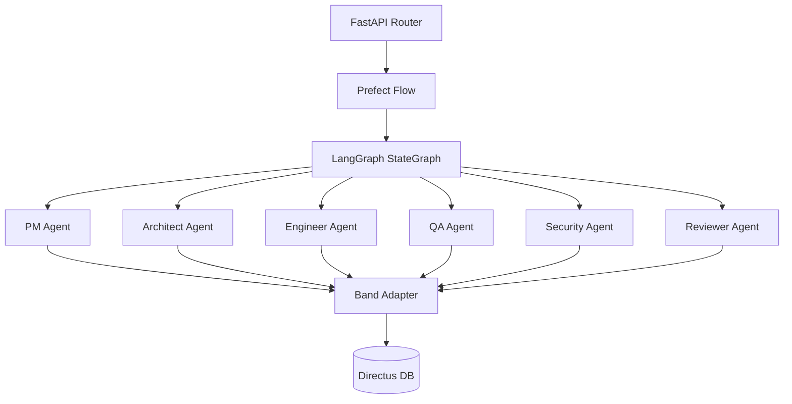

# TASK-004: Multi-Agent Intelligence and Workflow Implementation

## Metadata

| Field        | Value                                          |
| ------------ | ---------------------------------------------- |
| Task ID      | TASK-004 |
| Owner        | Antigravity                                    |
| Team Member  | Prashant                                       |
| Date Started | 2026-06-18                                     |
| Last Updated | 2026-06-18 |
| Status       | Completed                                      |
| Priority     | High                                           |

---

# Problem Statement

The backend intelligence, agent collaboration protocols, and workflow state engines (PydanticAI, LangGraph, Prefect, FastAPI) are not yet implemented. The frontend is currently relying on a client-side mock/simulator to update Directus database tables. To enable autonomous multi-agent operation, a complete Python backend must be developed following the CodeBand AI architecture.

---

# Objective

Implement the complete Python backend as specified in `docs/requirements/intelligence_implementation_V2.md`.
This includes:
1. Defining the six PydanticAI agents (`pm`, `architect`, `engineer`, `qa`, `security`, `reviewer`) with structured outputs.
2. Configuring Ollama as the local LLM runtime.
3. Setting up the LangGraph state machine and routing logic.
4. Setting up the Prefect flow execution layer.
5. Creating the FastAPI routes, services, and repository layers for Directus integration.
6. Ensuring the codebase builds and executes successfully.

---

# Context

This task moves the platform from client-side simulation to a real, autonomous multi-agent backend running locally on Ollama and integrating with Directus as the persistence layer.

---

# AI Session Summary

## Tools Used

- Gemini (Model)
- File Writing and Edit Tools
- Shell Execution Tools

---

## Prompts Summary

- Initial requirement: implement `docs/requirements/intelligence_implementation_V2.md` configured for local Ollama run.
- Build and verify the implementation.

---

## AI Recommendations

### Recommendation 1: Modular Packages
Use shared package directories `packages/shared_types`, `packages/band_adapter`, `packages/directus_client`, and `packages/workflow_sdk` to ensure reusable Python abstractions.

### Recommendation 2: Configuration via Environment Variables
Ensure all API endpoints, database keys, model parameters, and Ollama base URLs are configurable through a `.env` file and a central settings class.

---

# Decisions Made

✓ Recreate/rename packages and agents subdirectories using python-importable underscores (e.g. `pm_agent` instead of `pm-agent` to avoid import syntax errors).

✓ Implement Ollama connectivity using PydanticAI's `OpenAIModel` pointing to Ollama's OpenAI-compatible endpoint (`http://localhost:11434/v1`) for maximum stability.

---

# Technical Design

---

# Files Changed

<!-- FILES_CHANGED_START -->
- [agents/architect_agent/README.md](../../agents/architect_agent/README.md)
- [agents/architect_agent/__init__.py](../../agents/architect_agent/__init__.py)
- [agents/architect_agent/agent.py](../../agents/architect_agent/agent.py)
- [agents/architect_agent/models.py](../../agents/architect_agent/models.py)
- [agents/engineer_agent/README.md](../../agents/engineer_agent/README.md)
- [agents/engineer_agent/__init__.py](../../agents/engineer_agent/__init__.py)
- [agents/engineer_agent/agent.py](../../agents/engineer_agent/agent.py)
- [agents/engineer_agent/models.py](../../agents/engineer_agent/models.py)
- [agents/pm_agent/README.md](../../agents/pm_agent/README.md)
- [agents/pm_agent/__init__.py](../../agents/pm_agent/__init__.py)
- [agents/pm_agent/agent.py](../../agents/pm_agent/agent.py)
- [agents/pm_agent/models.py](../../agents/pm_agent/models.py)
- [agents/qa_agent/README.md](../../agents/qa_agent/README.md)
- [agents/qa_agent/__init__.py](../../agents/qa_agent/__init__.py)
- [agents/qa_agent/agent.py](../../agents/qa_agent/agent.py)
- [agents/qa_agent/models.py](../../agents/qa_agent/models.py)
- [agents/reviewer_agent/README.md](../../agents/reviewer_agent/README.md)
- [agents/reviewer_agent/__init__.py](../../agents/reviewer_agent/__init__.py)
- [agents/reviewer_agent/agent.py](../../agents/reviewer_agent/agent.py)
- [agents/reviewer_agent/models.py](../../agents/reviewer_agent/models.py)
- [agents/security_agent/__init__.py](../../agents/security_agent/__init__.py)
- [agents/security_agent/agent.py](../../agents/security_agent/agent.py)
- [agents/security_agent/models.py](../../agents/security_agent/models.py)
- [apps/api/src/__init__.py](../../apps/api/src/__init__.py)
- [apps/api/src/main.py](../../apps/api/src/main.py)
- [apps/api/src/routers/__init__.py](../../apps/api/src/routers/__init__.py)
- [apps/api/src/routers/agents.py](../../apps/api/src/routers/agents.py)
- [apps/api/src/routers/dashboard.py](../../apps/api/src/routers/dashboard.py)
- [apps/api/src/routers/projects.py](../../apps/api/src/routers/projects.py)
- [apps/api/src/routers/reports.py](../../apps/api/src/routers/reports.py)
- [apps/api/src/routers/workflows.py](../../apps/api/src/routers/workflows.py)
- [docs/requirements/intelligence_implementation_V2.md](../../docs/requirements/intelligence_implementation_V2.md)
- [graphify-out/.graphify_labels.json](../../graphify-out/.graphify_labels.json)
- [graphify-out/GRAPH_REPORT.md](../../graphify-out/GRAPH_REPORT.md)
- [graphify-out/cache/ast/0243495649a4a1d336480853a726e8e310d76592cba7df7472cee6b2623820e6.json](../../graphify-out/cache/ast/0243495649a4a1d336480853a726e8e310d76592cba7df7472cee6b2623820e6.json)
- [graphify-out/cache/ast/0c4591a6ff76310b0ca90f442e77bc1587c4b925a33718c1ec3f4d0cad5d007b.json](../../graphify-out/cache/ast/0c4591a6ff76310b0ca90f442e77bc1587c4b925a33718c1ec3f4d0cad5d007b.json)
- [graphify-out/cache/ast/0c793f5ae9e5dab09570de7568893269ee82dc868dd969590c13d831f41da503.json](../../graphify-out/cache/ast/0c793f5ae9e5dab09570de7568893269ee82dc868dd969590c13d831f41da503.json)
- [graphify-out/cache/ast/128b823b7888a05ee080f23a5864a5f62a3066832b4a002e175a8b3a61bc4608.json](../../graphify-out/cache/ast/128b823b7888a05ee080f23a5864a5f62a3066832b4a002e175a8b3a61bc4608.json)
- [graphify-out/cache/ast/17b466a9d282fff17d1284e4d5c80f2aecc9435b26241924d72536e1fc54bba8.json](../../graphify-out/cache/ast/17b466a9d282fff17d1284e4d5c80f2aecc9435b26241924d72536e1fc54bba8.json)
- [graphify-out/cache/ast/1919ecb7f096889fd3bff3d5b8ec4b974735ab245a8cbbfd4948b85726b3cca6.json](../../graphify-out/cache/ast/1919ecb7f096889fd3bff3d5b8ec4b974735ab245a8cbbfd4948b85726b3cca6.json)
- [graphify-out/cache/ast/34d90ed5dae2b4139b0aac3f8db635aa7408970bf168cb89a424d8a06bd1a3a4.json](../../graphify-out/cache/ast/34d90ed5dae2b4139b0aac3f8db635aa7408970bf168cb89a424d8a06bd1a3a4.json)
- [graphify-out/cache/ast/3621bb427b11ababeeecda09a515eb28ce98ca964f6abec3b5165f75e2fd519f.json](../../graphify-out/cache/ast/3621bb427b11ababeeecda09a515eb28ce98ca964f6abec3b5165f75e2fd519f.json)
- [graphify-out/cache/ast/3ac6e7104479889341ddcaee1e2a150264d372c3c3c0644663059e01d8a0c916.json](../../graphify-out/cache/ast/3ac6e7104479889341ddcaee1e2a150264d372c3c3c0644663059e01d8a0c916.json)
- [graphify-out/cache/ast/3ac8198a1a04ee11351a330db3fe2153bbd68e36b5402ac8f9f287b9501cff13.json](../../graphify-out/cache/ast/3ac8198a1a04ee11351a330db3fe2153bbd68e36b5402ac8f9f287b9501cff13.json)
- [graphify-out/cache/ast/3d4e21bb52bdefcf65840605aef59f88b30d740989e18a77f722072d864e3934.json](../../graphify-out/cache/ast/3d4e21bb52bdefcf65840605aef59f88b30d740989e18a77f722072d864e3934.json)
- [graphify-out/cache/ast/3d814e91c5ed2f4addfb0ef6a36f4a1ffa40ddf81fe7a78c0766136b3423b1d5.json](../../graphify-out/cache/ast/3d814e91c5ed2f4addfb0ef6a36f4a1ffa40ddf81fe7a78c0766136b3423b1d5.json)
- [graphify-out/cache/ast/479770685719f2e80fbec1dc22950375c386919ea9f7ef91168dbdfc5bcc72fc.json](../../graphify-out/cache/ast/479770685719f2e80fbec1dc22950375c386919ea9f7ef91168dbdfc5bcc72fc.json)
- [graphify-out/cache/ast/4868e1974331b5d77046a9ef7605e1e465baad58145d58f450e91aa9e51c8484.json](../../graphify-out/cache/ast/4868e1974331b5d77046a9ef7605e1e465baad58145d58f450e91aa9e51c8484.json)
- [graphify-out/cache/ast/4b157f75be822e23e7c9bdb90f7416a0be66ca11a2c770b4134c124a8a73429c.json](../../graphify-out/cache/ast/4b157f75be822e23e7c9bdb90f7416a0be66ca11a2c770b4134c124a8a73429c.json)
- [graphify-out/cache/ast/4ca166dc2a046a8b9056a9bbbc2ef0e7bb51dcc16a410c66a41da2ce40b80761.json](../../graphify-out/cache/ast/4ca166dc2a046a8b9056a9bbbc2ef0e7bb51dcc16a410c66a41da2ce40b80761.json)
- [graphify-out/cache/ast/4d7809ec3f71325b5756d4f82c1fc1babe76c8828aff5cb79c98d536bbe394b0.json](../../graphify-out/cache/ast/4d7809ec3f71325b5756d4f82c1fc1babe76c8828aff5cb79c98d536bbe394b0.json)
- [graphify-out/cache/ast/4ee9c6d543dde94b54a99fbbe2cc0773828ae5a920c831e8e0314a3d9db28b70.json](../../graphify-out/cache/ast/4ee9c6d543dde94b54a99fbbe2cc0773828ae5a920c831e8e0314a3d9db28b70.json)
- [graphify-out/cache/ast/5090e94346e06fbcca9075915ca8f5d981d5a4e2df1688ef9eafaf08989a3966.json](../../graphify-out/cache/ast/5090e94346e06fbcca9075915ca8f5d981d5a4e2df1688ef9eafaf08989a3966.json)
- [graphify-out/cache/ast/5946916453e0576d8d83b00533dea8ed7bb22e280c755b7c70f3d937a0a7fa7a.json](../../graphify-out/cache/ast/5946916453e0576d8d83b00533dea8ed7bb22e280c755b7c70f3d937a0a7fa7a.json)
- [graphify-out/cache/ast/5a9744dc2a92aa4f342961d42e8ce8a410d740d7f1d8ad826ad0a42295181322.json](../../graphify-out/cache/ast/5a9744dc2a92aa4f342961d42e8ce8a410d740d7f1d8ad826ad0a42295181322.json)
- [graphify-out/cache/ast/620917f093d132e7d00784dd3635da48d67861403348c44c61fd5166b92c1ec9.json](../../graphify-out/cache/ast/620917f093d132e7d00784dd3635da48d67861403348c44c61fd5166b92c1ec9.json)
- [graphify-out/cache/ast/6a7e165b0fdbe9c3cda7540bcc116b1a62ca2551ce56bc02debf7a317eacc573.json](../../graphify-out/cache/ast/6a7e165b0fdbe9c3cda7540bcc116b1a62ca2551ce56bc02debf7a317eacc573.json)
- [graphify-out/cache/ast/6c560ea14d667c4916e0d1157838bf22b78a433431ab1e56689fe3f3cea849f7.json](../../graphify-out/cache/ast/6c560ea14d667c4916e0d1157838bf22b78a433431ab1e56689fe3f3cea849f7.json)
- [graphify-out/cache/ast/6cdca2bcf2ac7ee5ad1795e015bb2543fcf1946f413fd6e26e8184ccc358cb76.json](../../graphify-out/cache/ast/6cdca2bcf2ac7ee5ad1795e015bb2543fcf1946f413fd6e26e8184ccc358cb76.json)
- [graphify-out/cache/ast/7400e71b337b92d9caaec6a527cb451fdb8bab835b6a9762b375b91c2cde5eb9.json](../../graphify-out/cache/ast/7400e71b337b92d9caaec6a527cb451fdb8bab835b6a9762b375b91c2cde5eb9.json)
- [graphify-out/cache/ast/74687150e21ed956cda58cd7c3d81ce2eaef940e8e3f2c7b7f93459a9bade496.json](../../graphify-out/cache/ast/74687150e21ed956cda58cd7c3d81ce2eaef940e8e3f2c7b7f93459a9bade496.json)
- [graphify-out/cache/ast/7fadad7cdfade747b6a753773e2613685b602af82906a29a4bfff9ff7a30986f.json](../../graphify-out/cache/ast/7fadad7cdfade747b6a753773e2613685b602af82906a29a4bfff9ff7a30986f.json)
- [graphify-out/cache/ast/7fc60f001759ed3f3a1a9b511d500ce67be7dfea646a369ff5c620a52ec309b4.json](../../graphify-out/cache/ast/7fc60f001759ed3f3a1a9b511d500ce67be7dfea646a369ff5c620a52ec309b4.json)
- [graphify-out/cache/ast/819319389731d9596c6d2bab83b36013261f6787a812d9a8e8ae09cd5cffd9ff.json](../../graphify-out/cache/ast/819319389731d9596c6d2bab83b36013261f6787a812d9a8e8ae09cd5cffd9ff.json)
- [graphify-out/cache/ast/82f7cab633685d48f951c26e60d30b3945ca362cb2bd9b053c37360f2673833e.json](../../graphify-out/cache/ast/82f7cab633685d48f951c26e60d30b3945ca362cb2bd9b053c37360f2673833e.json)
- [graphify-out/cache/ast/86a70e7a2ebcf31c75a8cd84ef523a055b42e12e6228b69b04c882d15dcbaad3.json](../../graphify-out/cache/ast/86a70e7a2ebcf31c75a8cd84ef523a055b42e12e6228b69b04c882d15dcbaad3.json)
- [graphify-out/cache/ast/897fdfe41d524863e1d2b352f3bb4b4a70bd85695d7e2df025179da7a9a7a1f8.json](../../graphify-out/cache/ast/897fdfe41d524863e1d2b352f3bb4b4a70bd85695d7e2df025179da7a9a7a1f8.json)
- [graphify-out/cache/ast/8b85513690f1f6380294d181ec48aab32d3fdbae523c0bd482562d4adc9c8c5b.json](../../graphify-out/cache/ast/8b85513690f1f6380294d181ec48aab32d3fdbae523c0bd482562d4adc9c8c5b.json)
- [graphify-out/cache/ast/8c6f0c7707feb67d2a9646da926a855b3ba08a06f20346b235584aa95d7141ad.json](../../graphify-out/cache/ast/8c6f0c7707feb67d2a9646da926a855b3ba08a06f20346b235584aa95d7141ad.json)
- [graphify-out/cache/ast/8cbd9e1a1c41d9a2e85a7022d21bffbd530bb271db123da455757f283bc19e9e.json](../../graphify-out/cache/ast/8cbd9e1a1c41d9a2e85a7022d21bffbd530bb271db123da455757f283bc19e9e.json)
- [graphify-out/cache/ast/8dc89716805d935ff88c9aa169d80c3489427b531cb95915db763e488dcf9a5f.json](../../graphify-out/cache/ast/8dc89716805d935ff88c9aa169d80c3489427b531cb95915db763e488dcf9a5f.json)
- [graphify-out/cache/ast/a42cb604123e7b5645f643f5092b0a479fa4021250394c31af61fbc04a0ce6dc.json](../../graphify-out/cache/ast/a42cb604123e7b5645f643f5092b0a479fa4021250394c31af61fbc04a0ce6dc.json)
- [graphify-out/cache/ast/a5af9836d651012587a31575f7e7068a7639aa1deb8cf7072196ca5bd73c986d.json](../../graphify-out/cache/ast/a5af9836d651012587a31575f7e7068a7639aa1deb8cf7072196ca5bd73c986d.json)
- [graphify-out/cache/ast/a940dfa127dddf0fa8da3690eb3ac0fc3e701854372b77c0451bf3bebe504b95.json](../../graphify-out/cache/ast/a940dfa127dddf0fa8da3690eb3ac0fc3e701854372b77c0451bf3bebe504b95.json)
- [graphify-out/cache/ast/b4380acc1dd1cf58b936f90263d18e5f2a67ff0c51313944dea1691f937f1aec.json](../../graphify-out/cache/ast/b4380acc1dd1cf58b936f90263d18e5f2a67ff0c51313944dea1691f937f1aec.json)
- [graphify-out/cache/ast/b798a492331fe7a065dd55b3db8ca0623c609572852461f075b65bcd667f2934.json](../../graphify-out/cache/ast/b798a492331fe7a065dd55b3db8ca0623c609572852461f075b65bcd667f2934.json)
- [graphify-out/cache/ast/c5ffe8880a33e7dfedb728c933b4442ccc258bd5ad88e3a062e6a77432aa405d.json](../../graphify-out/cache/ast/c5ffe8880a33e7dfedb728c933b4442ccc258bd5ad88e3a062e6a77432aa405d.json)
- [graphify-out/cache/ast/c88b86720a71677d353819d9813c44e12150d7ad360df586f2df3c61589b955a.json](../../graphify-out/cache/ast/c88b86720a71677d353819d9813c44e12150d7ad360df586f2df3c61589b955a.json)
- [graphify-out/cache/ast/c95bdff127a31dbac198675cb19a3d99e9e1adeda4edc44946a2d5ed7693ae53.json](../../graphify-out/cache/ast/c95bdff127a31dbac198675cb19a3d99e9e1adeda4edc44946a2d5ed7693ae53.json)
- [graphify-out/cache/ast/cd33be256ddd9d968a7b626685e6b7017b89be081086c4f0c5c77af8cc9e2012.json](../../graphify-out/cache/ast/cd33be256ddd9d968a7b626685e6b7017b89be081086c4f0c5c77af8cc9e2012.json)
- [graphify-out/cache/ast/ce26ccf07e85d2d441e52c6e4c9dcdfec176a40a0a305c4ccd0c0f5f6f33dc8c.json](../../graphify-out/cache/ast/ce26ccf07e85d2d441e52c6e4c9dcdfec176a40a0a305c4ccd0c0f5f6f33dc8c.json)
- [graphify-out/cache/ast/d1f13242d40a328522689d71d553027bef8d2174c0234d2983fb399c9d0472b2.json](../../graphify-out/cache/ast/d1f13242d40a328522689d71d553027bef8d2174c0234d2983fb399c9d0472b2.json)
- [graphify-out/cache/ast/d20178afb438216a3f00f2d0e2e1d71507b4baf727000e6cb76909d3ba3fc147.json](../../graphify-out/cache/ast/d20178afb438216a3f00f2d0e2e1d71507b4baf727000e6cb76909d3ba3fc147.json)
- [graphify-out/cache/ast/d25af958ce55a3b30f5fc8e09d095832b5580a3b8a3cf27af6b1631c159882cb.json](../../graphify-out/cache/ast/d25af958ce55a3b30f5fc8e09d095832b5580a3b8a3cf27af6b1631c159882cb.json)
- [graphify-out/cache/ast/d793737d21e6327404faad73361885fb08969f21091abe5f458760e5b22f2b31.json](../../graphify-out/cache/ast/d793737d21e6327404faad73361885fb08969f21091abe5f458760e5b22f2b31.json)
- [graphify-out/cache/ast/dd6127bc1b0cfc82eb3fe17a372e70caa239873e01690d3adbf7fe9e4172ac79.json](../../graphify-out/cache/ast/dd6127bc1b0cfc82eb3fe17a372e70caa239873e01690d3adbf7fe9e4172ac79.json)
- [graphify-out/cache/ast/de5113c4d08cb6cf6f77669cb51289d8b267b2d27f7a99fec8876aa16dcb9279.json](../../graphify-out/cache/ast/de5113c4d08cb6cf6f77669cb51289d8b267b2d27f7a99fec8876aa16dcb9279.json)
- [graphify-out/cache/ast/e66bf7f882c61d991fe42c1c35a10e8f0621bcdf1a8f7a71abcd4f04fabcaebb.json](../../graphify-out/cache/ast/e66bf7f882c61d991fe42c1c35a10e8f0621bcdf1a8f7a71abcd4f04fabcaebb.json)
- [graphify-out/cache/ast/e7b8433c38bd430a28b1846f84cfdd31500b99d8ad381b2105d1fa2ce6324db3.json](../../graphify-out/cache/ast/e7b8433c38bd430a28b1846f84cfdd31500b99d8ad381b2105d1fa2ce6324db3.json)
- [graphify-out/cache/ast/e8ad8632ff42c4299c859311df5d18b243b1c0badfee48e7042bd1b1ca36ffa8.json](../../graphify-out/cache/ast/e8ad8632ff42c4299c859311df5d18b243b1c0badfee48e7042bd1b1ca36ffa8.json)
- [graphify-out/cache/ast/e9b911d9268b4b755f2c7c40fce98ea0de25d55f3c6f1506ffc907e8ea15351b.json](../../graphify-out/cache/ast/e9b911d9268b4b755f2c7c40fce98ea0de25d55f3c6f1506ffc907e8ea15351b.json)
- [graphify-out/cache/ast/ef200074a59e5793150e29c79ac919134cf59f53a3cf28ca7741935873018e7c.json](../../graphify-out/cache/ast/ef200074a59e5793150e29c79ac919134cf59f53a3cf28ca7741935873018e7c.json)
- [graphify-out/cache/ast/f252a89b1f09460d835bb9c67ca4e4fa78fa6d95247a1acc446c7cac08cef1d0.json](../../graphify-out/cache/ast/f252a89b1f09460d835bb9c67ca4e4fa78fa6d95247a1acc446c7cac08cef1d0.json)
- [graphify-out/cache/ast/f33251138ae4cdb66b452944b70e28845ed8038195e734bd504c3b7030f96c84.json](../../graphify-out/cache/ast/f33251138ae4cdb66b452944b70e28845ed8038195e734bd504c3b7030f96c84.json)
- [graphify-out/cache/ast/f84d1eb96addcbdf18a3485e5b4f80176d7b201e63513d6d656f425962c87aa0.json](../../graphify-out/cache/ast/f84d1eb96addcbdf18a3485e5b4f80176d7b201e63513d6d656f425962c87aa0.json)
- [graphify-out/graph.html](../../graphify-out/graph.html)
- [graphify-out/graph.json](../../graphify-out/graph.json)
- [graphify-out/manifest.json](../../graphify-out/manifest.json)
- [packages/band_adapter/__init__.py](../../packages/band_adapter/__init__.py)
- [packages/band_adapter/client.py](../../packages/band_adapter/client.py)
- [packages/directus_client/__init__.py](../../packages/directus_client/__init__.py)
- [packages/directus_client/client.py](../../packages/directus_client/client.py)
- [packages/shared_types/__init__.py](../../packages/shared_types/__init__.py)
- [packages/shared_types/models.py](../../packages/shared_types/models.py)
- [packages/workflow_sdk/__init__.py](../../packages/workflow_sdk/__init__.py)
- [packages/workflow_sdk/framework.py](../../packages/workflow_sdk/framework.py)
- [requirements.txt](../../requirements.txt)
- [scripts/test_pipeline.py](../../scripts/test_pipeline.py)
- [workflows/__init__.py](../../workflows/__init__.py)
- [workflows/flows/__init__.py](../../workflows/flows/__init__.py)
- [workflows/flows/software_delivery_flow.py](../../workflows/flows/software_delivery_flow.py)
- [workflows/graphs/__init__.py](../../workflows/graphs/__init__.py)
- [workflows/graphs/software_delivery_graph.py](../../workflows/graphs/software_delivery_graph.py)
- [workflows/nodes/__init__.py](../../workflows/nodes/__init__.py)
- [workflows/nodes/architect_node.py](../../workflows/nodes/architect_node.py)
- [workflows/nodes/engineer_node.py](../../workflows/nodes/engineer_node.py)
- [workflows/nodes/pm_node.py](../../workflows/nodes/pm_node.py)
- [workflows/nodes/qa_node.py](../../workflows/nodes/qa_node.py)
- [workflows/nodes/reviewer_node.py](../../workflows/nodes/reviewer_node.py)
- [workflows/nodes/security_node.py](../../workflows/nodes/security_node.py)
- [workflows/state/__init__.py](../../workflows/state/__init__.py)
- [workflows/state/workflow_state.py](../../workflows/state/workflow_state.py)
<!-- FILES_CHANGED_END -->

---

# Open Questions

- None. All major framework and model configuration blockers have been successfully resolved.

---

# Next Steps

1. Configure production environment parameters for deployment on target Ubuntu machine.
2. Hook up frontend UI actions to REST API endpoints hosted in `apps/api`.
3. Add live Ollama / remote LLM connection validation checks for production settings.
