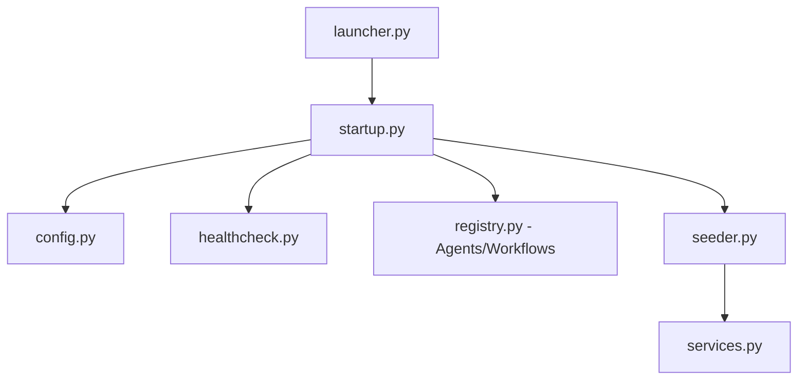

# TASK-005: Platform Bootstrapping and Registry Services

## Metadata

| Field        | Value                                          |
| ------------ | ---------------------------------------------- |
| Task ID      | TASK-005 |
| Owner        | Antigravity                                    |
| Team Member  | Prashant                                       |
| Date Started | 2026-06-18                                     |
| Last Updated | 2026-06-18 |
| Status       | Complete                                       |
| Priority     | High                                           |

---

# Problem Statement

The multi-agent orchestration architecture needs a central initialization and bootstrapping service to perform health checks, register workflow agents, and seed default database values on application startup.

---

# Objective

Implement the complete platform bootstrapping flow as described in `docs/requirements/bootstrap.md`, establishing:
1. PydanticSettings-based config management.
2. Health checking for external dependencies.
3. Central Service Registry for caching clients.
4. Database Seeder to register default agents and demo project metadata.
5. Startup lifecycle manager.
6. Unified launcher entry point.
7. Agent and Workflow registry lookups.

---

# Context

To make the platform easily demo-ready and deployable on the target Ubuntu virtual machine, the Bootstrap service orchestrates configuration, initialization, data seeding, and validation in a unified start sequence.

---

# AI Session Summary

## Tools Used

- Gemini (Model)
- File Writing and Edit Tools
- Shell Execution Tools

---

## Prompts Summary

- Requested bootstrap feature implementation matching the blueprint.
- Implemented and verified configuration, healthcheck, services, seeder, startup, launcher, and registries.

---

## AI Recommendations

### Recommendation 1: Mock-Friendly Startup Checks
Integrate automatic pass-through logic for connection checks when `DIRECTUS_MOCK_MODE=true`, enabling developers to run and test workflows locally without requiring a live Directus instance.

---

# Decisions Made

✓ Implement central lazy-initialization cache for `DirectusClient` and `DirectusBandClient` inside the service registry.

✓ Create agent/workflow registry lists mapping string keys to agent modules and LangGraph state graphs.

---

# Technical Design

---

# Files Changed

<!-- FILES_CHANGED_START -->
- [agents/registry.py](../../agents/registry.py)
- [apps/api/src/bootstrap/config.py](../../apps/api/src/bootstrap/config.py)
- [apps/api/src/bootstrap/healthcheck.py](../../apps/api/src/bootstrap/healthcheck.py)
- [apps/api/src/bootstrap/launcher.py](../../apps/api/src/bootstrap/launcher.py)
- [apps/api/src/bootstrap/seeder.py](../../apps/api/src/bootstrap/seeder.py)
- [apps/api/src/bootstrap/services.py](../../apps/api/src/bootstrap/services.py)
- [apps/api/src/bootstrap/startup.py](../../apps/api/src/bootstrap/startup.py)
- [docs/requirements/bootstrap.md](../../docs/requirements/bootstrap.md)
- [graphify-out/.graphify_labels.json](../../graphify-out/.graphify_labels.json)
- [graphify-out/GRAPH_REPORT.md](../../graphify-out/GRAPH_REPORT.md)
- [graphify-out/cache/ast/0b138a3048d40eda48d106fb6757b8aff70fdc98cd0acec25cbbf6075c9b4d67.json](../../graphify-out/cache/ast/0b138a3048d40eda48d106fb6757b8aff70fdc98cd0acec25cbbf6075c9b4d67.json)
- [graphify-out/cache/ast/276201238a372cd01161e40a7d5c890a2a8b566d0fec585ed9e6034959317642.json](../../graphify-out/cache/ast/276201238a372cd01161e40a7d5c890a2a8b566d0fec585ed9e6034959317642.json)
- [graphify-out/cache/ast/4253961c35b38118f704853073d7227581d24f9c18ae26bc32a11c0c22d9d64c.json](../../graphify-out/cache/ast/4253961c35b38118f704853073d7227581d24f9c18ae26bc32a11c0c22d9d64c.json)
- [graphify-out/cache/ast/4951e5d3d7f35ba661a99f125588f0153e835b3849702b176c67b96ce0c56f31.json](../../graphify-out/cache/ast/4951e5d3d7f35ba661a99f125588f0153e835b3849702b176c67b96ce0c56f31.json)
- [graphify-out/cache/ast/7c4e87060de630fe7d022af62cd42d35484c8be7275bab80337718ffeab56c2b.json](../../graphify-out/cache/ast/7c4e87060de630fe7d022af62cd42d35484c8be7275bab80337718ffeab56c2b.json)
- [graphify-out/cache/ast/8ca41e8058e0a7aa80c1923b7acfcc4f0785cc8cca4605eb1504276c786c17a8.json](../../graphify-out/cache/ast/8ca41e8058e0a7aa80c1923b7acfcc4f0785cc8cca4605eb1504276c786c17a8.json)
- [graphify-out/cache/ast/95b25227bb88962928ec9b8db46d0185c144693ada9cbbec4520c0a3be3b0de3.json](../../graphify-out/cache/ast/95b25227bb88962928ec9b8db46d0185c144693ada9cbbec4520c0a3be3b0de3.json)
- [graphify-out/cache/ast/b109cc93d948d1680d72c18ba5544f1ed6a80fd3917a20759263269dd97ddc91.json](../../graphify-out/cache/ast/b109cc93d948d1680d72c18ba5544f1ed6a80fd3917a20759263269dd97ddc91.json)
- [graphify-out/cache/ast/c5093dfaa782e272cddb604b27ee30e0b3dd784b0b1da92fc4c87f5c35c67765.json](../../graphify-out/cache/ast/c5093dfaa782e272cddb604b27ee30e0b3dd784b0b1da92fc4c87f5c35c67765.json)
- [graphify-out/cache/ast/e54058cda7387f44619e4d0b40ac25799aef787c2478323192b3a2f9df1d5ced.json](../../graphify-out/cache/ast/e54058cda7387f44619e4d0b40ac25799aef787c2478323192b3a2f9df1d5ced.json)
- [graphify-out/graph.html](../../graphify-out/graph.html)
- [graphify-out/graph.json](../../graphify-out/graph.json)
- [graphify-out/manifest.json](../../graphify-out/manifest.json)
- [workflows/registry.py](../../workflows/registry.py)
<!-- FILES_CHANGED_END -->

---

# Open Questions

- None. All bootstrap requirements and startup tests have successfully completed.

---

# Next Steps

1. Configure FastAPI lifespan hook to invoke the `StartupManager` on API application startup.
2. Wire up route triggers inside `apps/api/src/routers` to fetch workflow configurations dynamically from `workflows/registry.py`.
