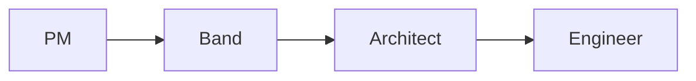

# TASK-009: <Task Title>

## Metadata

| Field        | Value                                          |
| ------------ | ---------------------------------------------- |
| Task ID      | TASK-009 |
| Owner        |                                                |
| Team Member  |                                                |
| Date Started | 2026-06-18 |
| Last Updated | 2026-06-18 |
| Status       | Not Started / In Progress / Blocked / Complete |
| Priority     | High / Medium / Low                            |

---

# Problem Statement

Describe the problem being solved.

Example:

Agents currently have no shared message contract which causes communication inconsistency.

---

# Objective

What should be achieved?

Example:

Create a shared Band message schema that all agents can use.

---

# Context

Why is this needed?

How does it fit into the overall architecture?

---

# AI Session Summary

## Tools Used

- ChatGPT
- Claude
- Cursor
- Gemini

---

## Prompts Summary

Summarize prompts used.

Example:

- Asked for Band message contract design
- Asked for event schema examples
- Asked for orchestration patterns

---

## AI Recommendations

### Recommendation 1

...

### Recommendation 2

...

---

# Decisions Made

Document final decisions.

Example:

✓ Use JSON message format

✓ Use event-driven architecture

✓ Use shared schema package

---

# Technical Design

Describe implementation approach.

---

# Files Changed

<!-- FILES_CHANGED_START -->
- [.env](../../.env)
<!-- FILES_CHANGED_END -->

---

# Open Questions

Describe any unresolved questions or blockers.

---

# Next Steps

List the next tasks or steps.
