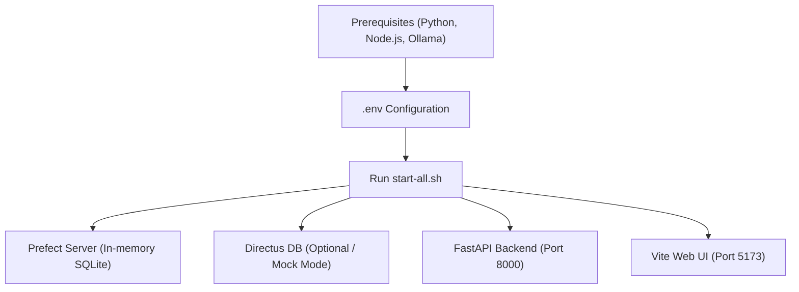

# TASK-012: Add Ubuntu Setup and Startup Scripts

## Metadata

| Field        | Value                                          |
| ------------ | ---------------------------------------------- |
| Task ID      | TASK-012 |
| Owner        | Antigravity                                    |
| Team Member  | Prashant                                       |
| Date Started | 2026-07-11                                     |
| Last Updated | 2026-07-11 |
| Status       | Complete                                       |
| Priority     | High                                           |

---

# Problem Statement

The `band-masd` repository lacks setup and start instructions for Ubuntu/Linux environments in the `README.md`. Currently, the `README.md` is empty, and the existing `startup_troubleshooting.md` is primarily oriented towards Windows Powershell. 

---

# Objective

Provide comprehensive setup instructions for starting the project on Ubuntu/Linux in the `README.md` and create a unified, robust startup shell script `start-all.sh` to automate the launch of all platform components (Prefect, FastAPI backend, Vite frontend, and optionally Directus database).

---

# Context

CodeBand AI platform depends on multiple external services (Ollama, Directus database, Prefect server) alongside its FastAPI backend and Vite frontend. Automating the startup process and documenting it for Linux developers is key to reducing onboarding friction and ensuring cross-platform stability.

---

# AI Session Summary

## Tools Used

- Gemini (Antigravity)

---

## Prompts Summary

- Requested details on starting the band-masd project on Ubuntu and documenting them in the README.

---

## AI Recommendations

### Recommendation 1

Create an executable bash script `start-all.sh` in the root workspace directory that manages starting and stopping background processes using standard Linux bash job control and process traps.

### Recommendation 2

Document this unified startup process, prerequisites, and config options clearly in the project's root `README.md`.

---

# Decisions Made

✓ Create a `start-all.sh` shell script.
✓ Document detailed Ubuntu/Linux startup steps and prerequisite installations in `README.md`.
✓ Automate clean termination handlers (SIGINT/SIGTERM) to clean up background ports and processes.

---

# Technical Design

---

# Files Changed

<!-- FILES_CHANGED_START -->
- [README.md](../../README.md)
- [apps/web/vite.config.ts](../../apps/web/vite.config.ts)
- [graphify-out/.graphify_labels.json](../../graphify-out/.graphify_labels.json)
- [graphify-out/GRAPH_REPORT.md](../../graphify-out/GRAPH_REPORT.md)
- [graphify-out/cache/ast/00597ab1bf3cf3cc3484bd8d5a505cf786c05438c71e2f906da29bc9bd75ec53.json](../../graphify-out/cache/ast/00597ab1bf3cf3cc3484bd8d5a505cf786c05438c71e2f906da29bc9bd75ec53.json)
- [graphify-out/cache/ast/38d5e704f67cf518b9cc44d973a254d967778fa75ccbda48a222154224e2ca40.json](../../graphify-out/cache/ast/38d5e704f67cf518b9cc44d973a254d967778fa75ccbda48a222154224e2ca40.json)
- [graphify-out/cache/ast/5434bfedd896644650dd6c991a019a59452e3f06abbaedb5777f827b919a421c.json](../../graphify-out/cache/ast/5434bfedd896644650dd6c991a019a59452e3f06abbaedb5777f827b919a421c.json)
- [graphify-out/cache/ast/5577107090ffe93909d2bd97d68545581bbe2528672046a03923034f5b6a77a9.json](../../graphify-out/cache/ast/5577107090ffe93909d2bd97d68545581bbe2528672046a03923034f5b6a77a9.json)
- [graphify-out/cache/ast/9f19a2b771db3461fd6d8512cf567f64baa8b1f39aa5995cfd54c0b6d2a67b02.json](../../graphify-out/cache/ast/9f19a2b771db3461fd6d8512cf567f64baa8b1f39aa5995cfd54c0b6d2a67b02.json)
- [graphify-out/cache/ast/a316c559e23041479b7272c44678b790c4a39da86785722389d84310cad607b2.json](../../graphify-out/cache/ast/a316c559e23041479b7272c44678b790c4a39da86785722389d84310cad607b2.json)
- [graphify-out/graph.html](../../graphify-out/graph.html)
- [graphify-out/graph.json](../../graphify-out/graph.json)
- [graphify-out/manifest.json](../../graphify-out/manifest.json)
- [start-all.sh](../../start-all.sh)
<!-- FILES_CHANGED_END -->

---

# Open Questions

- None

---

# Next Steps

1. Commit changes to the repository.
2. Run `graphify update .` to update the codebase knowledge graph (per user rules).
